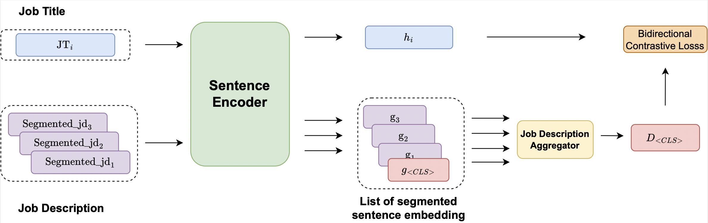
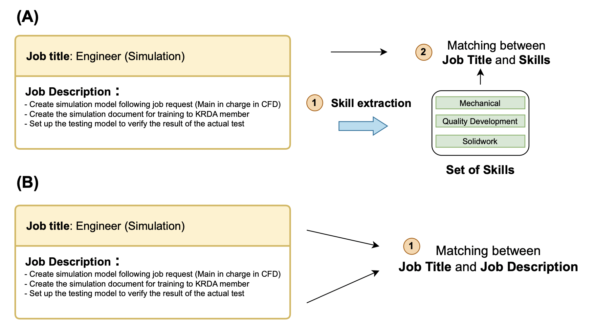

# Learning Job Title Representation from Job Description Aggregation Network
The official implementation of ACL 2024 findings ["Learning Job Title Representation from Job Descritpion Aggregation Network"](https://arxiv.org/pdf/2406.08055)




# Motivation



This work presents a novel framework for learning job title representations by using job description (B), bypassing the traditional dependence on skill extraction (A).


# Training dataset & Evaluation dataset

## Download dataset
Training dataset & Evaluation dataset : [Dataset](https://drive.google.com/drive/folders/1r0EyBPgC0AHw9f3DgKYRgeYAYrDzhoS4?usp=drive_link)

## Dataset details
The [mycareersfuture.sg](https://github.com/WING-NUS/JD2Skills-BERT-XMLC/tree/main) is used as a training dataset. We concatenate the fields "Role & Responsibilities" and "Job Requriement" to represent the job description.

The evaluation dataset is taken from [ESCO-Job Normalization](https://github.com/jensjorisdecorte/JobBERT-evaluation-dataset) where the goal is to predict the standized version of each job title. Following the original paper, we measure micro-average R@5,R@10 and MRR.

# JDAN pretraining model
Our pre-trained job title representation model can be found on 🤗 [https://huggingface.co/napatnicky/JDAN-mycareersfuture.sg](https://huggingface.co/napatnicky/JDAN-mycareersfuture.sg)
# Cite me 
If you use this model, please cite the following paper:
```@inproceedings{laosaengpha-etal-2024-learning,
    title = "Learning Job Title Representation from Job Description Aggregation Network",
    author = "Laosaengpha, Napat  and
      Tativannarat, Thanit  and
      Piansaddhayanon, Chawan  and
      Rutherford, Attapol  and
      Chuangsuwanich, Ekapol",
    editor = "Ku, Lun-Wei  and
      Martins, Andre  and
      Srikumar, Vivek",
    booktitle = "Findings of the Association for Computational Linguistics ACL 2024",
    month = aug,
    year = "2024",
    address = "Bangkok, Thailand and virtual meeting",
    publisher = "Association for Computational Linguistics",
    url = "https://aclanthology.org/2024.findings-acl.77",
    pages = "1319--1329",
    abstract = "Learning job title representation is a vital process for developing automatic human resource tools. To do so, existing methods primarily rely on learning the title representation through skills extracted from the job description, neglecting the rich and diverse content within. Thus, we propose an alternative framework for learning job titles through their respective job description (JD) and utilize a Job Description Aggregator component to handle the lengthy description and bidirectional contrastive loss to account for the bidirectional relationship between the job title and its description. We evaluated the performance of our method on both in-domain and out-of-domain settings, achieving a superior performance over the skill-based approach.",
}
```


# Acknowledgement
This work is supported in part by JOBTOPGUN,
job postings and recruitment platform in Thailand. We also would like to thank the Chulalongkorn Computational Molecular Biology Group
(CMB@CU) for providing additional computational resources.
